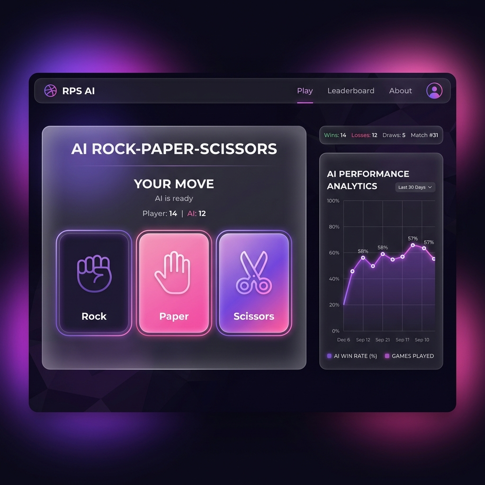

# AI Rock Paper Scissors (Pure Python)

This repository contains a professional Deep Learning AI agent designed to play Rock, Paper, Scissors using a Multi-Layer Perceptron built from scratch with NumPy. The AI performs online training during the game to adapt to human behavior in real-time.

## Project Structure
- `RPS.py`: Contains the `RPSAgent` which implements the OOP-based thread-safe Neural Network architecture.
- `RPS_game.py`: Testing scripts and benchmark bots (Quincy, Abbey, Kris, Mrugesh).
- `main.py`: Command line interface to test the AI.
- `app.py`: A pure Python interactive web interface powered by Gradio, featuring live analytics!

## How to Play
Run `python app.py` locally to start the web game. This project is a **Pure Python** Machine Learning showcase and is optimized for deployment on Hugging Face Spaces (Gradio) or Render, rather than Vercel.
